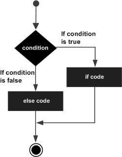
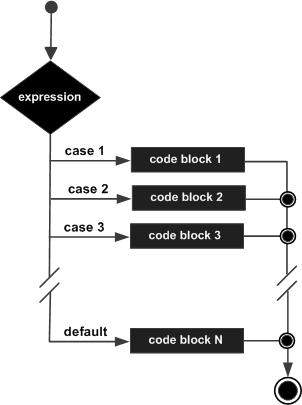

---
---

```{r knitr_init, echo=F, cache=FALSE,results='markup'}
library(knitr)
opts_chunk$set(echo=T,
	       cache=T,
               prompt=FALSE,
               tidy=T,
               comment=NA,
               message=FALSE,
               warning=FALSE)
```

<link rel="stylesheet" type="text/css" href="mystyle.css">

<div class="icon-bar">
  <a href="graphics.html" class="prev">PREVIOUS PAGE</a>
  <a href="loops.html" class="next">NEXT PAGE</a>
</div>


<a href="index.html">
  
</a>

<div style="background-color:crimson;color:white;padding:20px;">
<h2> **CONDITIONAL STATEMENT IN R**</h2>
---
<p>
Conditional statements are decision making structure which are tested by the program, along with a statement or statements to be executed if the condition is determined to be true, and optionally, other statements to be executed if the condition is determined to be false.
</p>
</div>

<br/>
<br/>
<br/>


The general flow chart of a conditional structure is:

```{r, out.width = "200px",echo=FALSE}
knitr::include_graphics("images/r_decision_making.png")
```

R provides the following types of decision making statements:

+ if statements
+ if else statements
+ switch statements

#### if satement:

The basic syntax for creating an if statement in R is −

```
if(conditional_expression) {
    statement(s) will execute if the conditional expression is true.
}
```
If the conditional expression evaluates to be true, then the block of code inside the if statement will be executed. If conditional expression evaluates to be false, then the first set of code after the end of the if statement (after the closing curly brace) will be executed.

The flow diagram for if statement is:

```{r, out.width = "200 px",echo=FALSE}
    knitr::include_graphics("images/r_if_statement.jpg")
```

An example of if statement is:

```{r}
x=20
if (x<30) {
  print("Cotton University")
}
```

#### if-else statement:

Here an if statement is followed by an optional else statement which executes when the conditional expression is false.

The basic syntax for creating an if...else statement in R is −

```
if(condition_expression) {
    statement(s) will execute if the condition expression is true.
} else {
    statement(s) will execute if the condition expression is false.
}
```
If the condition expression evaluates to be true, then the if block of code will be executed, otherwise else block of code will be executed.

The flow diagram of if-else statement is:

```{r, out.width = "200px",echo=FALSE}
    
```

An example of if-else statement:

```{r}
marks=c(15,45,65,78,13,45,8,60)

for (i in 1:8) {
        if (marks[i]<30) {
            print("FAIL")
}
        else {
            print("PASS")
        }
}

```

An if statement can be followed by an optional else if...else statement, which is very useful to test various conditions using single if...else if statement.

When using if, else if, else statements there are few points to keep in mind.

+ An if can have zero or one else and it must come after any else if's.

+ An if can have zero to many else if's and they must come before the else.

+ Once an else if succeeds, none of the remaining else if's or else's will be tested.

The basic syntax for creating an `if...else if...else` statement in R is −
```
if(condition_expression 1) {
    Executes when the condition expression 1 is true.
} else if( condition_expression 2) {
    Executes when the condition expression 2 is true.
} else if( condition_expression 3) {
    Executes when the condition expression 3 is true.
} else {
    Executes when none of the above condition is true.
}
```
An example of nested if-else statement:

```{r}
data=c(15,45,65,78,13,45,8,60)
for (i in 1:length(data)) {
  if(data[i]<30){
    print("FAIL")
    }
  else if(data[i]>=30 && data[i]<45){
    print("Third division")
  }
  else if(data[i]>=45 && data[i]<60){
    print("Second division")
  }
  else {
    print("First division")
    }
}
```
#### switch statement:

A switch statement allows a variable to be tested for equality against a list of values. Each value is called a case, and the variable being switched on is checked for each case.

The basic syntax for creating a switch statement in R is −

```
switch(expression, case1, case2, case3....)
```

The following rules apply to a switch statement −

+ If the value of expression is not a character string it is coerced to integer.

+ You can have any number of case statements within a switch. Each case is followed by the value to be compared to and a colon.

+ If the value of the integer is between 1 and nargs()−1 (The max number of arguments)then the corresponding element of case condition is evaluated and the result returned.

+ If expression evaluates to a character string then that string is matched (exactly) to the names of the elements.

+ If there is more than one match, the first matching element is returned.

+ No Default argument is available.

+ In the case of no match, if there is a unnamed element of ... its value is returned. (If there is more than one such argument an error is returned.)

The flow diagram of switch statement is

```{r, out.width = "200px",echo=FALSE}
        
```

An example of switch statement:

```{r}
x=c(1,3,5,7,9)
test=1
test_result=switch (test,
  mean = mean(x),
  med = median(x),
  max = max(x)
)
test_result
```

<br>
<br>
<br>
<br>

<div class="box1">
<h4>NOTE:</h4>
<p>
Here the switch statement is use to switch between `mean`, `median` and `max` functions. The `test` variable determines which function inside the `switch statement` is to executed.
</p>
</div>


