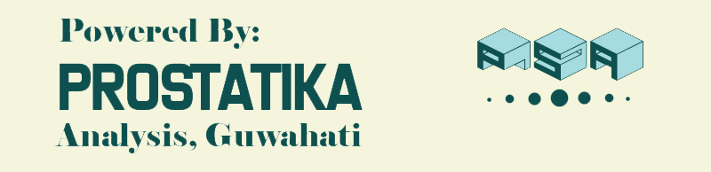

---
---

<!-- Calling the CSS -->

<link rel="stylesheet" href="mystyle.css" type="text/css">

<!-- Website Logo -->

<!-- R Tutorial banner -->
<!-- 
 -->
 <!--  -->
 <!--  <a href="what_is_r.html"> -->
 <!--    <button>R Tutorial </button> -->
 <!--  </a> -->
<!-- 
 -->

 
 
 
 
 
 

<h5>
_This is a free-to-all and open sourced website for easy to follow Statistical tutorials._

Here you will find tutorial on-

<li>R Programming for Basic Statistical Calculations</li>

<li>SPSS for Statistical Analysis</li>

<li>Bio-Statistics</li>

<li>And More ... </li>

</h5>

 
 
 

  <h3>ANNOUNCMENTS</h3>
  ---
  
The End Semester Examination for SEC: Statistical Computation With R for the department of Physics will be held on 07/12/2018 from 11.00AM @ Computer Cell, Library Building

   
  
The End Semester Examination for SEC: Statistical Computation With R for the department of EBWS will be held on 07/12/2018 from 1.00PM in the Department of Statistics, MCB Building

   
  
The End Semester Examination for SEC: Statistical Computation With R for the Department of Computer Science & IT (MCA) will be held on 10/12/2018 from 11.00AM @ Computer Cell, Library Building. Please contact your department for details.

 
 
 
 
 

<h5>
_This site is under-construction. Feel free to contact me if you face any difficulty_
</h5>

